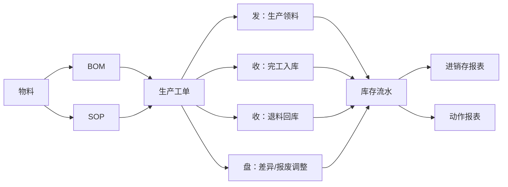

# 现有模块到新架构迁移映射方案

## 1. 文档目的

本文档用于说明当前 `inventory-system-codex` 系统中的现有功能模块，如何兼容并迁移到“前台收发转盘，后台进销存核算”的新架构。

本文档重点回答以下问题：

- 当前模块是否保留
- 当前模块在新架构中的定位是什么
- 一级导航如何调整
- 现有页面和能力如何兼容
- BOM / SOP / 生产等关键模块如何与新方案协同
- 分阶段迁移时哪些功能先动、哪些功能后动

本文档面向：

- 产品设计
- 前后端开发
- 测试与实施
- 业务负责人

## 2. 当前系统模块清单

当前主导航包括：

- 仪表盘
- 物料管理
- 仓库管理
- 发货管理
- SOP管理
- BOM管理
- 生产管理
- 数据统计
- 报表中心
- 用户管理

从业务属性看，这些模块实际混合了三种不同层级：

1. 主数据与规则层
   - 物料管理
   - SOP管理
   - BOM管理
2. 业务执行层
   - 仓库管理
   - 发货管理
   - 生产管理
3. 统计与系统层
   - 仪表盘
   - 数据统计
   - 报表中心
   - 用户管理

当前问题不是“模块缺失”，而是“层次混排”。

## 3. 新架构的总体兼容原则

### 3.1 不是推倒重来

新方案不是删除当前模块，而是对模块重新分层和重新归位。

原则如下：

- 保留现有专业能力
- 重构一线作业入口
- 让库存动作统一落到 `收 / 发 / 转 / 盘`
- 让报表核算继续按 `进销存` 输出

### 3.2 三层结构

迁移后的系统建议形成三层结构：

#### 第一层：主数据与规则层

- 物料
- BOM
- SOP

#### 第二层：业务执行层

- 收
- 发
- 转
- 盘
- 生产

#### 第三层：统计与系统层

- 仪表盘
- 报表
- 数据统计
- 系统设置

### 3.3 兼容关系原则

必须明确：

- `BOM / SOP` 不是库存动作，不应并入收发转盘
- `生产管理` 不是库存动作本身，而是驱动库存动作的业务中枢
- `仓库管理` 不应继续作为混合入口，应拆分为仓库主数据与收发转盘执行入口
- `发货管理` 应作为 `发` 的一个子场景存在

## 4. 新导航结构建议

建议未来主导航调整为：

- 仪表盘
- 物料
- 收
- 发
- 转
- 盘
- 生产
- 报表
- 系统

### 4.1 二级菜单建议

#### 生产

- 生产工单
- SOP
- BOM

#### 报表

- 动作报表
- 进销存报表
- 库存价值
- 生产分析

#### 系统

- 仓库资料
- 用户管理
- 权限配置

说明：

- 若短期不做大规模导航改造，可先保留原有菜单，但在页面内部重构关系
- 长期建议按上面结构统一

## 5. 模块映射总表

| 当前模块 | 新架构定位 | 是否保留 | 新归属 | 说明 |
| --- | --- | --- | --- | --- |
| 仪表盘 | 总览层 | 保留 | 仪表盘 | 增加动作视角与核算视角并存 |
| 物料管理 | 主数据层 | 保留 | 物料 | 继续作为全系统主数据根 |
| 仓库管理 | 主数据 + 执行混合层 | 部分保留、部分拆分 | 系统 / 收发转盘 | 仓库资料保留，入出调盘拆走 |
| 发货管理 | 执行层 | 保留能力，调整入口 | 发 | 作为“发”的销售发货子场景 |
| SOP管理 | 规则层 | 保留 | 生产 | 定义工艺，不并入动作层 |
| BOM管理 | 规则层 | 保留 | 生产 | 定义结构，不并入动作层 |
| 生产管理 | 业务控制层 | 保留并增强 | 生产 | 成为连接规则层与动作层的中枢 |
| 数据统计 | 统计层 | 保留 | 报表 | 建议偏分析看板 |
| 报表中心 | 核算层 | 保留 | 报表 | 进销存和库存价值主出口 |
| 用户管理 | 系统层 | 保留 | 系统 | 不受本次业务架构调整影响 |

## 6. 各模块详细兼容方案

## 6.1 仪表盘

### 当前定位

- 总览系统经营与库存情况

### 新定位

- 继续作为统一首页
- 同时展示两套视角：
  - 动作视角
  - 核算视角

### 建议调整

- 增加今日 `收 / 发 / 转 / 盘` 摘要卡片
- 保留低库存、库存总量、库存价值等核算类指标
- 对生产型企业增加：
  - 待领料工单
  - 待完工入库工单
  - 盘点差异待处理

### 是否阻塞迁移

- 否
- 可作为第一阶段视觉调整内容

## 6.2 物料管理

### 当前定位

- 管理物料主档、库存阈值、分类等基础信息

### 新定位

- 保留为全系统主数据根

### 与新架构的关系

- `收 / 发 / 转 / 盘` 全部依赖物料
- `BOM / SOP / 生产` 全部依赖物料
- 报表也按物料汇总

### 结论

- `必须保留一级专业模块`
- `不能并入收发转盘`

## 6.3 仓库管理

### 当前问题

当前仓库管理通常混合了两种能力：

- 仓库主数据维护
- 仓库作业执行

这在新架构下需要拆分。

### 新定位

拆分为两部分：

#### A. 系统/基础资料层

保留：

- 仓库主数据
- 库位
- 仓库启停用
- 仓库权限

建议归属：

- `系统 > 仓库资料`

#### B. 业务执行层

拆出并分别归入：

- 入库 -> `收`
- 出库 -> `发`
- 调拨 -> `转`
- 盘点 -> `盘`

### 结论

- “仓库管理”不再作为主要业务一级入口
- 但仓库资料能力必须保留

## 6.4 发货管理

### 当前定位

- 管理销售类出库、发货单、客户发运

### 新定位

- 保留发货单能力
- 调整为 `发` 模块下的子场景

建议归属：

- `发 > 销售发货`

### 原因

对现场用户来说：

- 发货只是“发”的一种

对系统来说：

- 发货仍然必须保留独立业务类型
- `biz_type = sales_shipment`

### 迁移方式

- 页面入口从一级菜单移动到 `发`
- 原发货单表和接口先保留
- 未来再统一单据模型

## 6.5 SOP管理

### 当前定位

- 定义工艺步骤与所需物料

### 新定位

- 保留为生产域规则层模块
- 不并入 `收 / 发 / 转 / 盘`

建议归属：

- `生产 > SOP`

### 原因

SOP 的本质是：

- 定义“怎么做”
- 不是库存动作

它与新方案的关系是：

- `SOP` 定义工艺
- `生产工单` 引用 SOP
- 工单执行才触发：
  - `发 > 生产领料`
  - `收 > 完工入库`

### 结论

- `必须保留`
- `只能做位置重组，不能做功能删除`

## 6.6 BOM管理

### 当前定位

- 定义物料结构与用量关系

### 新定位

- 保留为生产域结构层模块
- 不并入 `收 / 发 / 转 / 盘`

建议归属：

- `生产 > BOM`

### 原因

BOM 的本质是：

- 定义“做什么需要什么”
- 不是库存动作

它与新方案的关系是：

- `BOM` 作为生产领料和成本核算的上游定义
- 真正影响库存的是：
  - 工单领料
  - 完工入库
  - 差异调整

### 结论

- `必须保留`
- `不可改造成动作页`

## 6.7 生产管理

### 当前定位

- 管理工单、齐套、状态流转、生产执行

### 新定位

- 成为连接 `物料 / BOM / SOP` 与 `收 / 发 / 盘` 的业务中枢

建议归属：

- `生产 > 生产工单`

### 关键职责

- 创建工单
- 引用 BOM / SOP
- 做齐套检查
- 管理工单状态
- 触发动作层单据

### 与新方案的协同关系

#### 工单开始前

- 由 `生产管理` 做齐套检查

#### 工单开始时

- 触发 `发 > 生产领料`

#### 工单完工时

- 触发 `收 > 完工入库`

#### 工单取消或异常时

- 触发：
  - `收 > 退料回库`
  - 或 `盘 > 差异调整`

### 结论

- `生产管理` 不但不能删除，反而要增强
- 它应成为新架构里最关键的连接器

## 6.8 数据统计

### 当前定位

- 偏经营分析与看板

### 新定位

- 归入 `报表` 域
- 偏向分析类视图

建议归属：

- `报表 > 数据统计`

### 建议输出内容

- 动作趋势
- 仓库吞吐
- 物料周转
- 领料/完工对比
- 差异与损耗分析

## 6.9 报表中心

### 当前定位

- 正式报表出口

### 新定位

- 保留为核算与经营报表中心

建议归属：

- `报表 > 报表中心`

### 新方案下应新增的报表层次

#### A. 动作报表

- 收货报表
- 发料/发货报表
- 调拨报表
- 盘点差异报表

#### B. 核算报表

- 进销存汇总
- 库存余额表
- 库存价值表

#### C. 生产分析报表

- 工单领料
- 工单完工
- 齐套缺料
- 报废损耗

## 6.10 用户管理

### 当前定位

- 系统管理功能

### 新定位

- 不受业务架构变化影响
- 归入系统设置层

建议归属：

- `系统 > 用户管理`

## 7. 重点模块协同关系

### 7.1 BOM / SOP / 生产 / 收发盘 的协同结构

### 7.2 设计结论

- `BOM / SOP` 是定义层
- `生产管理` 是控制层
- `收 / 发 / 转 / 盘` 是执行层
- `报表` 是核算与分析层

## 8. 分阶段迁移方案

## 8.1 第一阶段：信息架构重组

目标：

- 不改变底层数据结构
- 先重构菜单与模块归类

工作内容：

- 一级导航原型设计
- 模块名称与入口调整
- 页面面包屑与标题统一
- 用户培训文案同步

### 结果

- 用户先感知到“新结构”
- 老功能仍可工作

## 8.2 第二阶段：现有执行功能归位

目标：

- 将现有执行页面重新归入 `收 / 发 / 转 / 盘`

工作内容：

- 发货管理 -> `发 > 销售发货`
- 仓库入库 -> `收`
- 仓库出库 -> `发`
- 仓库调拨 -> `转`
- 仓库盘点 -> `盘`

### 结果

- 一线作业入口稳定
- 认知成本下降

## 8.3 第三阶段：生产中枢打通

目标：

- 让工单驱动动作页，而不是人工分别操作多个模块

工作内容：

- 生产工单开始 -> 生成领料单
- 生产完工 -> 生成完工入库单
- 生产取消 -> 生成退料或差异单

### 结果

- `生产管理` 与 `收 / 发 / 盘` 建立真正闭环

## 8.4 第四阶段：报表层统一

目标：

- 建立双层报表口径

工作内容：

- 动作报表
- 进销存报表
- 生产分析报表
- 库存价值报表

### 结果

- 一线管理、经营分析、老板看数都使用统一底账

## 9. 页面改造建议

### 9.1 短期页面策略

建议先采用“保留现有页面，调整入口归类”的方式：

- 改导航
- 改标题
- 改入口
- 改说明文案

不立刻重写所有页面。

### 9.2 中期页面策略

对执行层页面逐步重构为：

- 动作工作台
- 单据列表
- 单据详情
- 审核/执行入口

### 9.3 长期页面策略

形成以下体验：

- 计划人员进入 `生产`
- 仓库员进入 `收 / 发 / 转 / 盘`
- 老板进入 `报表`

## 10. 数据与接口改造影响

### 10.1 需要保留不动的对象

- materials
- boms
- sops
- production_orders

### 10.2 需要增强的对象

- stock_movements
- shipments
- warehouses
- statistics / reports

### 10.3 需要增加的语义字段

建议逐步补齐：

- `biz_type`
- `source_doc_type`
- `source_doc_id`
- `execution_status`
- `approved_by`

## 11. 风险与边界

### 11.1 常见误区

- 误区一：把 `BOM / SOP / 生产` 全并到收发转盘里
- 误区二：只改菜单名字，不改职责边界
- 误区三：让动作页直接承担全部业务定义职责

### 11.2 正确边界

- 动作页负责执行
- 规则页负责定义
- 工单页负责控制
- 报表页负责核算

## 12. 验收标准

完成迁移后，应满足：

- 仓库员能通过 `收 / 发 / 转 / 盘` 完成日常操作
- 生产主管能通过 `生产管理` 驱动领料与完工
- BOM / SOP 保留完整专业定义能力
- 发货能力完整保留，但入口已并入 `发`
- 仓库资料维护已从仓库作业入口中剥离
- 报表仍能稳定输出进销存结果
- 新老用户都能理解模块边界

## 13. 结论

当前系统中的功能模块大部分都不需要删除，而是需要重新归类。

兼容新方案的正确结论是：

- `物料 / BOM / SOP` 保留，并定位为规则与主数据层
- `生产管理` 保留并增强，定位为业务控制中枢
- `发货管理` 下沉并入 `发`
- `仓库管理` 拆成“仓库资料”与“收发转盘执行功能”
- `数据统计 / 报表中心` 继续保留，但统一纳入报表层

最终目标不是“减少模块数量”，而是“让模块边界更清楚、入口语言更符合角色认知、底层核算口径更稳定”。

