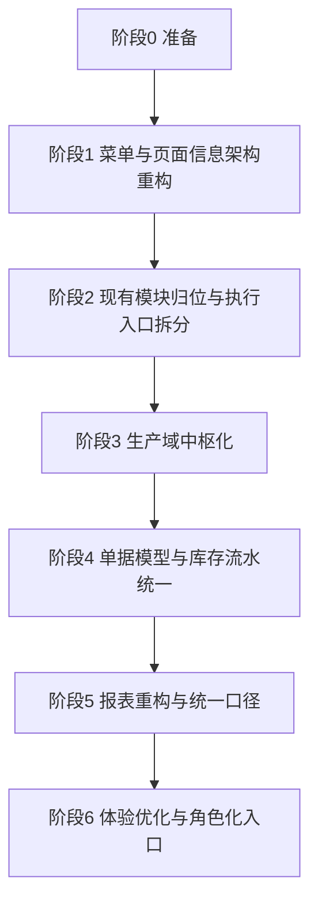

# 项目实施路线图

## 1. 文档目的

本文档用于将以下四份方案文档收敛成统一的项目执行总纲：

- `收发转盘与进销存双层架构实施方案`
- `现有模块到新架构迁移映射方案`
- `菜单与页面重构实施清单`
- `单据模型与库存流水映射设计`

本文档的作用不是补充细节，而是统一回答：

- 项目的总目标是什么
- 先做什么、后做什么
- 每一阶段依赖什么
- 每一阶段交付什么
- 什么时候可以进入下一阶段
- 哪些工作属于架构重构，哪些属于功能增强

本文档面向：

- 项目负责人
- 产品设计
- 前后端开发
- 测试
- 管理层

## 2. 项目背景

当前系统服务于公司内部生产与仓储管理，业务背景包括：

- 车间生产
- 射频设备与无人机反制相关产品装配
- 原材料、半成品、成品、辅料混合管理
- 仓储动作与生产动作并存
- 管理层同时关注现场效率和库存核算结果

当前系统已有较完整的专业能力：

- 物料管理
- 仓库管理
- 发货管理
- SOP管理
- BOM管理
- 生产管理
- 数据统计
- 报表中心

但当前问题在于：

- 模块层级混排
- 一线操作入口不符合现场语言
- 单据模型与库存流水语义不足
- 报表核算口径未完全标准化

## 3. 项目总目标

本项目最终目标是建立一套“双层业务语言、统一底层核算”的内部管理系统：

### 3.1 前台操作层目标

让仓库员、车间主管按照现场动作理解和操作系统：

- 收
- 发
- 转
- 盘

### 3.2 专业能力层目标

保留并强化以下专业能力：

- 物料
- BOM
- SOP
- 生产工单

### 3.3 后台核算层目标

让库存和报表仍然遵循统一核算公式：

- 期初 + 入 - 出 = 期末

### 3.4 最终业务目标

系统同时满足：

- 一线好用
- 车间好懂
- 管理层看数稳定
- 后续可扩展

## 4. 路线图总原则

### 4.1 先重构认知，再重构内核

第一步先解决：

- 菜单结构
- 页面归类
- 用户路径

第二步再解决：

- 单据模型
- 库存流水
- 报表口径

### 4.2 先兼容，再替换

原则上不推翻现有模块，而是：

- 保留已有能力
- 重新归位
- 逐步接管

### 4.3 先入口整合，再流程打通

先让用户能在新结构下找到正确入口，再让模块之间自动联动。

### 4.4 先确保口径，再做报表扩展

如果底层流水和来源类型不统一，报表不应提前大改。

## 5. 目标系统结构

项目完成后的目标结构建议如下：

### 一级导航

- 仪表盘
- 物料
- 收
- 发
- 转
- 盘
- 生产
- 报表
- 系统

### 二级结构

#### 生产

- 生产工单
- SOP
- BOM

#### 报表

- 数据统计
- 报表中心
- 动作报表
- 进销存报表
- 库存价值
- 生产分析

#### 系统

- 仓库资料
- 用户管理
- 权限设置

## 6. 项目阶段划分

本项目建议拆分为 6 个阶段推进。

## 阶段 0：准备阶段

### 6.1 目标

- 形成统一实施口径
- 明确范围、优先级和角色

### 6.2 输入

- 四份方案文档
- 当前系统代码与数据库
- 业务方确认意见

### 6.3 输出

- 本路线图
- 项目优先级确认
- 阶段验收口径

### 6.4 通过标准

- 管理层确认新架构方向
- 开发确认分阶段执行方式

## 阶段 1：菜单与页面信息架构重构

### 7.1 目标

- 让用户先感知到新架构
- 不破坏现有功能使用

### 7.2 核心任务

- 重构侧边栏导航
- 重构页面归类
- 调整页面标题与文案
- 将 `SOP / BOM / 生产管理` 归入生产域
- 将 `数据统计 / 报表中心` 归入报表域
- 将 `用户管理` 归入系统域
- 将 `发货管理` 从一级菜单迁出并准备并入 `发`
- 将 `仓库管理` 的执行入口从基础资料中分离

### 7.3 影响模块

- 前端导航与路由
- 页面标题与面包屑
- 用户手册

### 7.4 交付物

- 新导航结构
- 页面映射表
- 页面入口原型

### 7.5 进入下一阶段前必须满足

- 新菜单可用
- 所有旧页面仍可到达
- 业务用户能理解新入口

## 阶段 2：现有模块归位与执行入口拆分

### 8.1 目标

- 完成从旧模块结构到新作业入口的过渡

### 8.2 核心任务

- 发货管理并入 `发`
- 仓库管理拆分为：
  - 仓库资料
  - 收发转盘执行入口
- 新建 `收 / 发 / 转 / 盘` 工作台页面
- 旧页面先保留，入口从新模块进入

### 8.3 影响模块

- 仓库管理
- 发货管理
- 仪表盘快捷入口

### 8.4 交付物

- 收工作台
- 发工作台
- 转工作台
- 盘工作台
- 发货入口迁移
- 仓库资料入口迁移

### 8.5 进入下一阶段前必须满足

- 仓库员已可不依赖“仓库管理”完成日常作业
- 发货能力已从“发”进入

## 阶段 3：生产域中枢化

### 9.1 目标

- 明确 `BOM / SOP / 生产工单` 的分层关系
- 让生产模块成为动作层的业务驱动中枢

### 9.2 核心任务

- `生产管理` 改造为 `生产工单`
- 增加生产域首页
- 工单页面明确动作关系：
  - 开工 -> 发料
  - 完工 -> 入库
  - 取消/异常 -> 退料/盘点调整
- 保留并强化：
  - SOP
  - BOM

### 9.3 影响模块

- 生产管理
- SOP管理
- BOM管理

### 9.4 交付物

- 生产域首页
- 生产工单主页面
- SOP/BOM 新归位入口
- 工单动作说明与引导

### 9.5 进入下一阶段前必须满足

- 用户能明确区分：
  - BOM 是结构
  - SOP 是工艺
  - 工单是执行

## 阶段 4：单据模型与库存流水统一

### 10.1 目标

- 用统一技术模型支撑新架构

### 10.2 核心任务

- 给库存流水统一补齐：
  - `movement_type`
  - `biz_type`
  - `source_doc_type`
  - `source_doc_id`
- 补齐状态机规则
- 明确库存影响时点
- 建立统一库存执行服务
- 明确 `转` 与 `盘` 的特殊口径

### 10.3 影响模块

- 发货管理
- 仓库出入库
- 生产工单
- 统计与报表
- 数据库与服务层

### 10.4 交付物

- 统一库存流水设计
- 单据执行服务
- 状态机规则
- 数据回填方案

### 10.5 进入下一阶段前必须满足

- 所有库存变化都能追到来源单据
- 不能再存在“直接改余额”的核心链路

## 阶段 5：报表重构与统一口径

### 11.1 目标

- 建立动作报表与核算报表双层体系

### 11.2 核心任务

- 保留并稳定进销存报表
- 增加动作报表：
  - 收
  - 发
  - 转
  - 盘
- 增加生产分析报表
- 增加库存价值与差异分析

### 11.3 影响模块

- 数据统计
- 报表中心
- 仪表盘

### 11.4 交付物

- 动作日报
- 进销存报表
- 库存价值报表
- 生产分析报表

### 11.5 进入下一阶段前必须满足

- 报表口径统一
- 管理层与财务能稳定使用

## 阶段 6：体验优化与角色化入口

### 12.1 目标

- 让不同角色进入系统后看到最适合自己的入口

### 12.2 核心任务

- 仪表盘角色化
- 快捷操作入口优化
- 页面说明文案统一
- 动作工作台视觉优化
- 培训文档与用户手册更新

### 12.3 影响模块

- 仪表盘
- 收发转盘各工作台
- 用户手册

### 12.4 交付物

- 角色化首页
- 快捷入口
- 操作手册新版

## 7. 阶段依赖关系

推荐依赖关系如下：

补充说明：

- 阶段 1 可以独立先行
- 阶段 4 是整个项目的技术核心
- 阶段 5 必须建立在阶段 4 之后

## 8. 各阶段优先级

### 必做阶段

- 阶段 1
- 阶段 2
- 阶段 3
- 阶段 4

### 强烈建议做

- 阶段 5

### 可在稳定后迭代

- 阶段 6

## 9. 里程碑定义

### 里程碑 M1：用户看见新架构

完成条件：

- 新导航上线
- 模块归类完成
- 旧功能不受损

对应阶段：

- 阶段 1

### 里程碑 M2：仓库与车间有新入口

完成条件：

- 收发转盘入口可用
- 仓库资料已剥离
- 发货已归入发

对应阶段：

- 阶段 2

### 里程碑 M3：生产域结构稳定

完成条件：

- 工单、SOP、BOM 结构清晰
- 生产域首页可用

对应阶段：

- 阶段 3

### 里程碑 M4：库存底账统一

完成条件：

- 单据驱动库存
- 流水字段统一
- 状态机合法

对应阶段：

- 阶段 4

### 里程碑 M5：报表口径统一

完成条件：

- 进销存、动作报表、生产分析均可稳定输出

对应阶段：

- 阶段 5

## 10. 推荐开发顺序

如果按开发效率和风险控制排序，推荐顺序如下：

1. 导航重构
2. 页面归类与标题调整
3. 收发转盘工作台
4. 发货归发
5. 仓库页拆分
6. 生产域首页
7. 工单动作说明与入口
8. 库存流水字段与服务层重构
9. 报表统一
10. 仪表盘角色化

## 11. 项目风险与应对

### 11.1 风险一：前台改了，底层没跟上

表现：

- 菜单变了
- 但库存与报表逻辑仍旧混乱

应对：

- 阶段 4 必须列为核心阶段

### 11.2 风险二：过早重写全部页面

表现：

- 交付周期过长
- 现有系统不可持续使用

应对：

- 先做入口和归类调整
- 先兼容旧页面

### 11.3 风险三：把 BOM / SOP / 生产误并到动作层

表现：

- 页面职责混乱
- 规则层与执行层边界消失

应对：

- 生产域保持独立
- 只让工单驱动作业单据

### 11.4 风险四：报表提前重构

表现：

- 报表口径不稳定

应对：

- 报表必须等库存流水模型统一后再整体推进

## 12. 当前阶段建议

结合当前已有文档和系统状态，推荐立即执行的阶段是：

- 阶段 1：菜单与页面信息架构重构

理由：

- 风险最低
- 对用户感知最直接
- 不依赖数据库大改
- 能为后续各阶段提供稳定入口结构

## 13. 与已有文档的关系

本路线图作为总纲，使用方式如下：

- 方向与原则，查看：
  - `收发转盘与进销存双层架构实施方案`
- 模块兼容与定位，查看：
  - `现有模块到新架构迁移映射方案`
- 页面执行顺序，查看：
  - `菜单与页面重构实施清单`
- 技术底层设计，查看：
  - `单据模型与库存流水映射设计`

## 14. 结论

本项目不是单一页面改版，而是一次分阶段的业务架构重构。

路线图的核心结论是：

- 第一阶段先改信息架构
- 第二阶段归位现有模块
- 第三阶段建立生产中枢
- 第四阶段统一单据与库存流水
- 第五阶段统一报表口径
- 第六阶段再做体验优化

最重要的是保持节奏：

- 不急于一次性重写所有功能
- 先让结构清楚
- 再让数据统一
- 最后再让体验拔高

